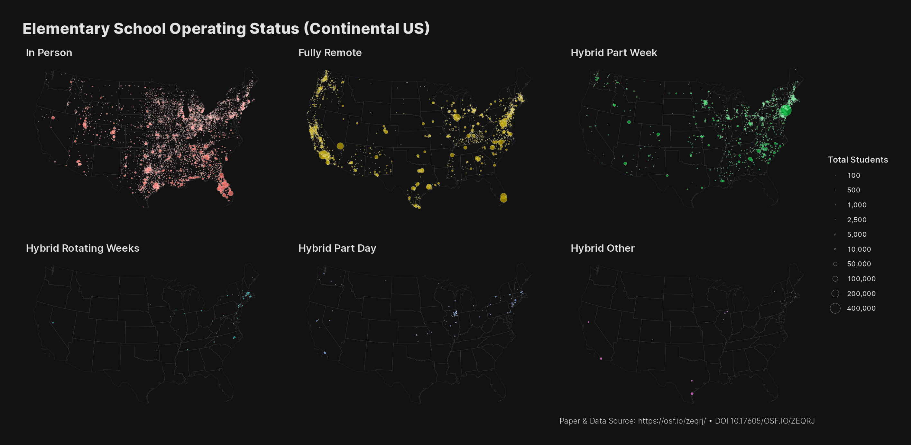

# Elementary School Operating Status + NCES 2019-2020 School District Boundaries

## Elementary School Operating Status State Aggregate

> Landivar, Liana C, Leah Ruppanner, William Scarborough, Caitlyn Collins, Jake Sower, Lloyd Rouse, Mary Ntalianis, et al. 2021. “Elementary School Operating Status.” OSF. April 8. doi:10.17605/OSF.IO/ZEQRJ.

[Elementary School Operating Status w1.csv](https://files.osf.io/v1/resources/zeqrj/providers/osfstorage/606d08c651f7ae0239f50caf?action=download&direct&version=1) via <https://osf.io/zeqrj/>

**NOTE** that the `NCES district ID` field _needs_ to have all of the values of length `6` padded with a leading `0` to be joined with the NCES boundaries or the generated centroids provided here.

## School District Boundaries

[Single Composite File (207 MB)](https://nces.ed.gov/programs/edge/data/EDGE_SCHOOLDISTRICT_TL20_SY1920.zip) via <https://nces.ed.gov/programs/edge/Geographic/DistrictBoundaries>

The `GEOID` in this NCES shapefile and `nces-edge-centroids.geojson` (below) == `NCES district ID` in the ESOS datafile.

## Local Files

- `us-fips-metadata.json` : U.S. State FIPS metadata (ndjson/jsonlines format)
- `nces-edge-centroids.geojson` : District centroids from the `DGE_SCHOOLDISTRICT_TL20_SY1920` shapefile
- `states-albers-composite.geojson` : AlbersUSA composite of the U.S. (with only Alaska & Hawaii which aren't used in the above map)
- `esos-nces-district-status-facets.R` : R code to collect & "fix" the ESOS data, then join it with the centroids shapefile to produce the map above

## Important

The `Elementary School Operating Status w1.csv` schema is altered from the defaults in `esos-nces-district-status-facets.R` that `readr::read_csv()` would have used. Notably, the `State FIPS code` and `NCES district ID` are forced to be character columns. See `esos-nces-district-status-facets.R` for the {readr} spec.

MIT license also only applies to the artifacts I've created. See the source sites for ESOS and NCES license requirements.
